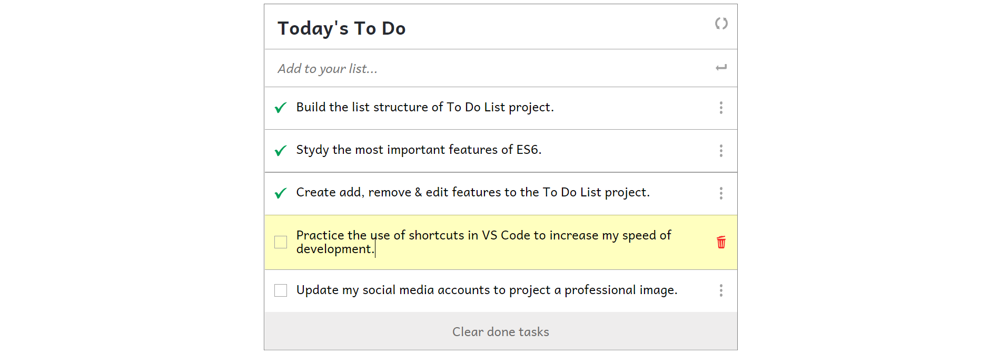

# To do list

"To-do list" is a tool that helps to organize your day. It simply lists the things that you need to do and allows you to mark them as complete.

## Features

- It is based in a minimalistic design.
- It render the task list dinamically using javascript.
- Create a new task by entering the description in the field *Add to your list* and pressing the *enter key* or the *enter button*.
- Delete one or more tasks by selecting their checkboxes and pressing the button *Clear done tasks*.
- Edit any task already listed by clicking on its description.

## Built With

- HTML / CSS / Javascript

## Live Demo

[To Do List](https://gabyse1.github.io/to-do-list/dist/)

## Getting Started

To get a local copy up and running follow these simple example steps.

### Prerequisites

- Have a computer

### Install

- Install git on your local computer.
- Clone this repository to your local computer. Choose the location you prefer.
- Run the command *npm install* to install all project's dependencies.

### Deployment

- Run the command line *npm run start*.
- The project will automatically open the *index.html* file in a browser.

## Authors

👤 **Gabriela Sánchez Espirilla**

- GitHub: [@gabyse1](https://github.com/gabyse1)
- Twitter: [@gabyse0](https://twitter.com/gabyse0)
- LinkedIn: [Gabriela](https://www.linkedin.com/in/gabriela-s%C3%A1nchez-espirilla-83011b225/)

## 🤝 Contributing

Contributions, issues, and feature requests are welcome!

Feel free to check the [issues page](../../issues/).

## Show your support

Give a ⭐️ if you like this project!

## Acknowledgments

- Model: [web.archive.org.](https://web.archive.org/web/20180320194056/http://www.getminimalist.com:80/)

## 📝 License

This project is [MIT](./MIT.md) licensed.
